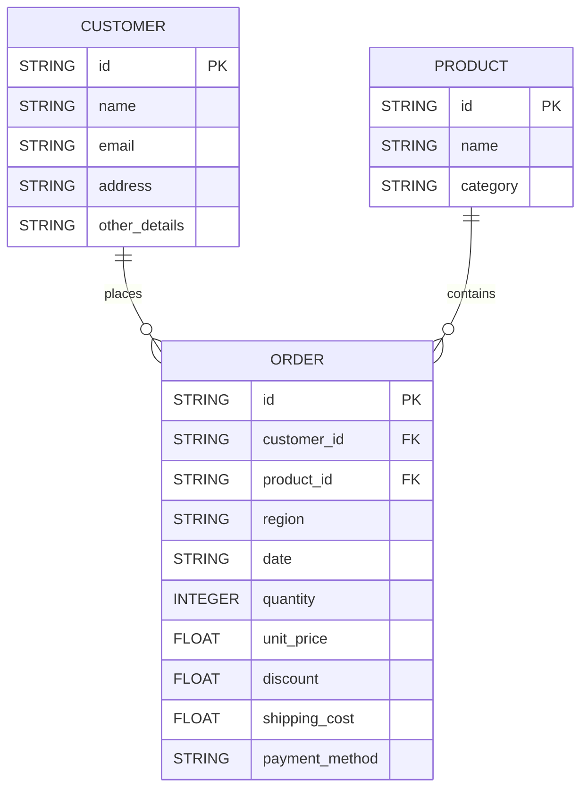

# Product Assessment


## Setup Instructions

1. **Clone the repository**
   ```bash
   git clone https://github.com/abhimp/ProductAssessment
   cd productAssessment
   ```

1. **Install dependencies**
   ```bash
   pip install -r requirements.txt
   ```

1. **Prepare your CSV file**
   - Place your input CSV (with the required headers) in the project directory.

1. **Run the REST API server**
   ```bash
   python rest_api.py --db product_assessment.db --csv input.csv
   ```
   - You can change the database or CSV file name using the `--db` and `--csv` arguments.

1. **Access the API**
   - The API will be available at: [http://localhost:8080](http://localhost:8080)

---

## API Endpoints

| Route                              | Method | Body         | Sample Response                                    | Description                                           |
|-------------------------------------|--------|--------------|----------------------------------------------------|-------------------------------------------------------|
| `/total_revenue`                    | GET    | N/A          | `{ "total_revenue": 12345.67 }`                    | Total revenue for a date range                        |
| `/total_revenue_by_product`         | GET    | N/A          | `[{"product_id": "P1", "total_revenue": 1000.0}]`  | Revenue by product for a date range                   |
| `/total_revenue_by_category`        | GET    | N/A          | `[{"category": "Electronics", "total_revenue": 500}]` | Revenue by category for a date range              |
| `/total_revenue_by_region`          | GET    | N/A          | `[{"region": "West", "total_revenue": 2000.0}]`    | Revenue by region for a date range                    |
| `/revenue_trends`                   | GET    | N/A          | `[{"period": "2024-01", "total_revenue": 1000.0}]` | Revenue trends (monthly/quarterly/yearly) for a range |

### Query Parameters

All endpoints require these query parameters unless otherwise noted:

- `start_date` (string, required): Start date in `YYYY-MM-DD` format
- `end_date` (string, required): End date in `YYYY-MM-DD` format
- `/revenue_trends` also accepts `interval` (`monthly`, `quarterly`, `yearly`), default is `monthly`

### Example Requests

**Total Revenue**
```
GET /total_revenue?start_date=2024-01-01&end_date=2024-12-31
```

**Total Revenue by Product**
```
GET /total_revenue_by_product?start_date=2024-01-01&end_date=2024-12-31
```

**Revenue Trends (Quarterly)**
```
GET /revenue_trends?start_date=2024-01-01&end_date=2024-12-31&interval=quarterly
```

---

## Notes

- The server automatically updates the database from the CSV file every 60 seconds and creates a timestamped backup after each update.
- If any required numeric field in a row is invalid, that row is skipped.
- The API runs on port `8080` by default.

---

## Database Schema

